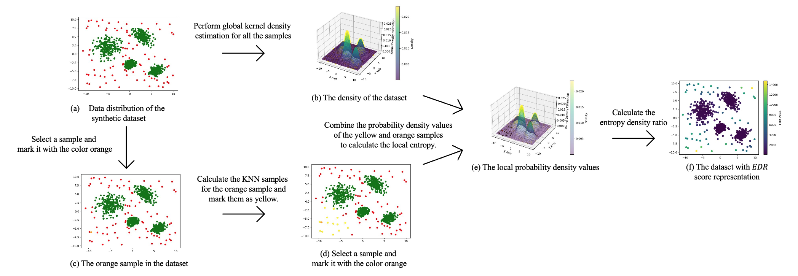
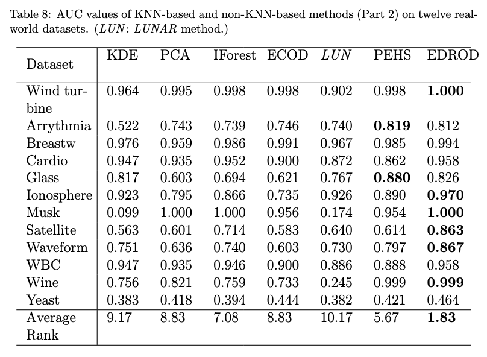

# EDROD: Entropy Density Ratio Outlier Detection

This repo contains the official implementation fot the paper EDROD by Kaituo Zhang, Wei Huang.


**EDROD** is a parameter-free, unsupervised anomaly detection algorithm based on entropy density ratios. It detects suspicious samples in high-dimensional datasets without requiring model training.

## 🚀  Features

- Effective detection of both point anomalies and cluster anomalies.
- Strong robustness to the number of selected nearest neighbors.
- Supports AUC evaluation when ground truth is available
- Clean and modular Python implementation

## 🧪 Experiments

We conducted experiments on real-world datasets and obtain the results.



## 📦 Installation

We provide the code of EDROD to detect anomaly.

### 🧩 Environment

```bash
cd EDROD
```

Using `pip`:

```bash
pip install -r requirements.txt
```

Or using `conda`:

```bash
conda create -n edrod_env python=3.9 pandas=1.5.3 numpy=1.23.5 scikit-learn=1.2.2
```

### 💻  Usage

```python
python3 main.py --data_name musk --n_neighbors 50
```

If you have a new dataset, you only need to upload it to the dataset folder and specify the corresponding `data_name`. The results can then be obtained directly.

#### Arguments

| Argument        | Description                                 |
| --------------- | ------------------------------------------- |
| `--data_name`   | The name of dataset                         |
| `--n_neighbors` | Number of neighbors for entropy calculation |
| `--path_prefix` | Optional path prefix to dataset files       |

## 📈 Example Output

If you run the example:

```
python3 main.py --data_name musk --n_neighbors 50
```

you will get:

```makefile
AUC: 1.00
```

If you run another example:

```
python3 main.py --data_name waveform --n_neighbors 50
```

You will get:

```makefile
AUC:  0.861487
```

## 📁 File Structure

```bash
.
├── README.md                  # Project documentation (top-level)
├── EDROD/
│   ├── main.py                # Entry point script
│   ├── LICENSE
│   ├── model.py               # EDROD algorithm class
│   ├── README.md              # Internal module documentation
│   ├── requirements.txt       # Python dependencies
│   ├── dataset/               # Folder for datasets
│   └── utils/                 # Utility picture

```

## 📖 Citation

If you use this code in your research, please cite:

```nginx
Coming soon...
```

## 📝 License

This project is licensed under the MIT License - see the [LICENSE](/EDROD/LICENSE) file for details.
